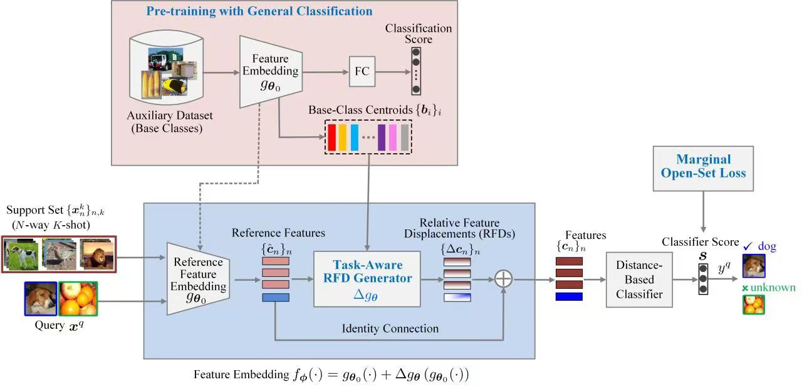

# RFDNet——Learning Relative Feature Displacement for Few-Shot Open-Set Recognition

## Abstract
Few-shot learning (FSL) usually assumes that the query is drawn from the same label space as the support set, while queries from unknown classes may emerge unexpectedly in many open-world application scenarios. Such an open-set issue will limit the practical deployment of FSL systems, which remains largely unexplored. In this paper, we investigate the problem of few-shot open-set recognition (FSOR) and propose a novel solution, called Relative Feature Displacement Network  (RFDNet), which empowers FSL systems to reject queries from unknown classes while accurately classifying those from known classes. First, we suggest a different relative feature displacement learning (RFDL) paradigm for FSOR, i.e., meta-learning a feature displacement relative to a pretrained reference feature embedding, based on our insightful observations on the randomness drift issue of previous meta-learning based for FSOR methods, as well as the generalization ability of the feature embedding pretrained for general classification. Second, we design the RFDNet framework to implement the RFDL paradigm, which is mainly featured by a task-aware RFD generator and a marginal open-set loss.  Comprehensive experiments on three public datasets, i.e., miniImageNet, CIFAR-FS and tieredImageNet, demonstrate that RFDNet can consistently outperform  the state-of-the-art  methods, achieving improvement of 5.2\%, 2.0\% and 1.7\% respectively, %, with an improvement of \%5.2, \%2.0 and \%1.7 respectively, in terms of AUROC for unknown-class rejection under the 5-way 5-shot setting.

### 
Fig. 1. The proposed Relative Feature Displacement Network (RFDNet).
     

### 
Fig. 2. Pipeline of the Task-Aware RFD Generator.
   

## Citation
If you find Simple Shot useful in your research, please consider citing:
@article{deng2022rfdnet,
  title={Learning relative feature displacement for few-shot open-set recognition},
  author={Shule Deng, Jin-Gang Yu, Zihao Wu, Hongxia Gao, Yangsheng Li and Yang Yang},
  journal={IEEE Transactions on Multimedia},
  pages={1--12},
  year={2022},
  publisher={IEEE}
}

## Usage
### 1.Dependencies
(1) Python 3.8.10  
(2) Pytorch 1.8.1  
(3) CUDA 11.2  

### 2. Download Datasets
### 2.1 Mini-ImageNet
You can download the dataset from https://drive.google.com/file/d/1fJAK5WZTjerW7EWHHQAR9pRJVNg1T1Y7/view

### 2.2 Tiered-ImageNet
You can download the dataset from https://drive.google.com/file/d/1g1aIDy2Ar_MViF2gDXFYDBTR-HYecV07/view.

### 2.3 CIFAR-FS
You can download the dataset from https://drive.google.com/drive/folders/12RSelk-cW_nkOPkeux1TIcX53BBOfFyN?usp=sharing

### 3. Training
### 3.1 Pre-training
python pretrain.py  
 
you can also download our pre-trained models from https://drive.google.com/drive/folders/16tQ8XnGO2OhpD2DPpchoJ916-Vs01gbn

### 3.2 Meta-training
python train.py -c /path/to/config/file/dataset_name.config

## Contact
If you have any question, please feel free to email us. (audsl@mail.scut.edu.cn)

